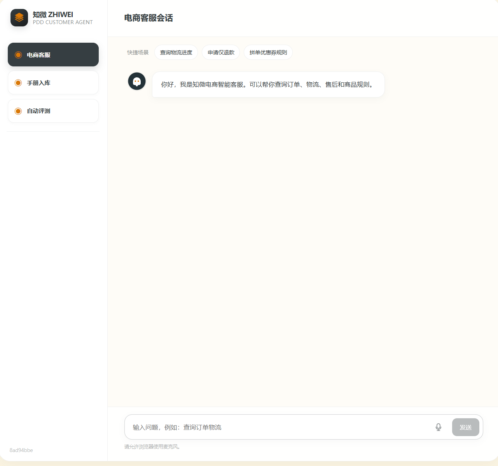
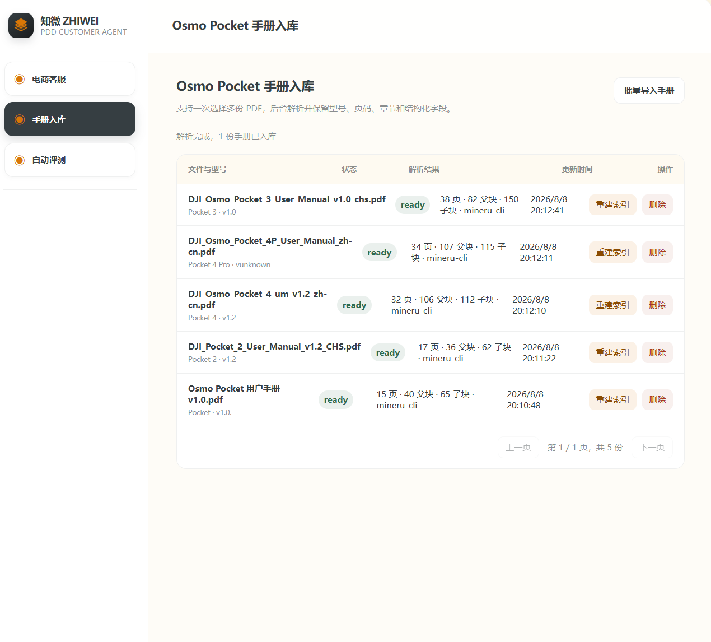
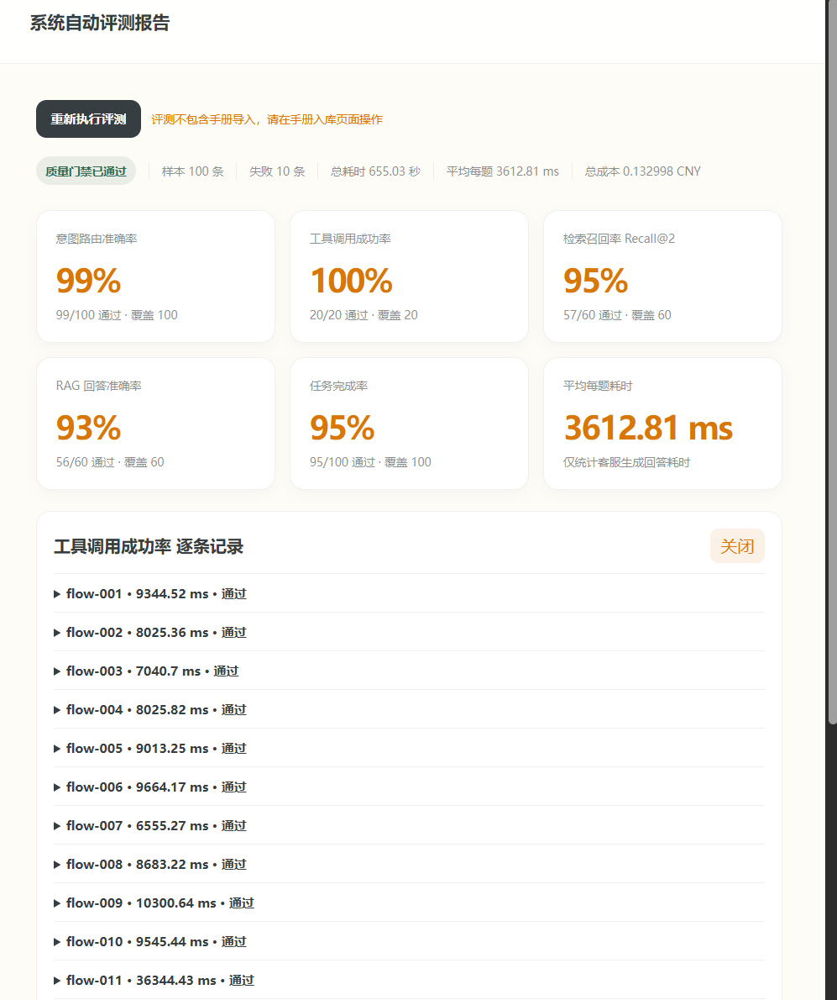

# 鐭ュ井 Agent 鐢靛晢瀹㈡湇绯荤粺

闈㈠悜鐢靛晢瀹㈡湇楂橀鍜ㄨ銆佽鍗曠墿娴佸拰鍞悗澶勭悊鍦烘櫙锛屾惌寤?Agent 鏅鸿兘瀹㈡湇绯荤粺銆傜郴缁熼€氳繃鎰忓浘鍒嗘祦銆佸彈鎺?ReAct銆丗unction Calling 鍜?RAG 鐭ヨ瘑搴撴绱紝瀹屾垚璁㈠崟鐗╂祦鏌ヨ銆佸敭鍚庝俊鎭敹闆嗐€佸晢鍝佹墜鍐岄棶绛斿拰鑷姩鍖栬瘎娴嬶紝瑙ｅ喅浜哄伐閲嶅鏌ヨ銆佺煡璇嗘绱㈡參銆佷笂涓嬫枃鏄撲涪澶辩瓑闂锛屾彁鍗囧鏈嶅搷搴旀晥鐜囦笌鍥炵瓟鍑嗙‘鎬с€?
<p>
  
  
  
  
  
  
  
</p>

## 鎶€鏈爤

Python / FastAPI / React / TypeScript / DeepSeek-V4-Flash / ReAct / Function Calling / PostgreSQL / pgvector / MinerU / BGE-small-zh / BGE-Reranker-Base / Docker Compose

## 鏍稿績鎸囨爣

| 鎸囨爣 | 褰撳墠缁撴灉 | 璇存槑 |
|------|---------:|------|
| 鏍锋湰瑙勬ā | 100 鏉?| 瑕嗙洊璁㈠崟銆佺墿娴併€佸敭鍚庛€侀棽鑱婂拰鎵嬪唽鐭ヨ瘑闂瓟 |
| 鎰忓浘璺敱鍑嗙‘鐜?| 99% | 99/100 閫氳繃 |
| 宸ュ叿璋冪敤鎴愬姛鐜?| 100% | 20/20 閫氳繃 |
| 妫€绱㈠彫鍥炵巼 Recall@2 | 95% | 57/60 閫氳繃 |
| RAG 鍥炵瓟鍑嗙‘鐜?| 93% | 56/60 閫氳繃 |
| 浠诲姟瀹屾垚鐜?| 95% | 95/100 閫氳繃 |
| 骞冲潎姣忛鑰楁椂 | 3612.81 ms | 浠呯粺璁″鏈嶇敓鎴愬洖绛旇€楁椂 |
| 鎬昏€楁椂 | 655.03 绉?| 100 鏉¤瘎娴嬫€昏€楁椂 |
| 鎬绘垚鏈?| 0.132998 CNY | 鎸?DeepSeek-V4-Flash 杈撳叆杈撳嚭 token 浠锋牸鎶樼畻 |

## 绯荤粺娴佺▼

```mermaid
flowchart LR
    U[鐢ㄦ埛闂] --> R[鎰忓浘璇嗗埆涓庢Ы浣嶅～鍏匽
    R -->|璁㈠崟鎴栫墿娴亅 T[Function Calling 宸ュ叿璋冪敤]
    R -->|鍞悗| A[鍞悗棰勮涓庝簩娆＄‘璁
    R -->|鍟嗗搧鐭ヨ瘑| K[RAG 鐭ヨ瘑妫€绱
    R -->|闂茶亰鎴栨棤娉曞鐞唡 C[鐩存帴鍥炲鎴栬浆浜哄伐]

    T --> P[(PostgreSQL 璁㈠崟涓庣墿娴佹暟鎹?]
    A --> P
    K --> V[(pgvector 瀛愬潡鍚戦噺)]
    K --> B[(BM25 鏂囨湰绱㈠紩)]
    V --> F[RRF 铻嶅悎]
    B --> F
    F --> E[BGE-Reranker 绮炬帓]
    E --> G[鍥炴函鐖跺潡涓婁笅鏂嘳

    P --> H[Harness 缂栨帓]
    G --> H
    C --> H
    H --> S[瀹夊叏鏍￠獙涓庤劚鏁廬
    S --> O[瀹㈡湇鍥炲]

    H --> M[(鐭湡璁板繂銆佹憳瑕佽蹇嗐€侀暱鏈熻蹇?]
    M --> R
```

## 绯荤粺鑳藉姏

### 1. 鏂囨。瑙ｆ瀽鍏ュ簱

绯荤粺鏀寔鍦ㄥ墠绔壒閲忎笂浼?Osmo Pocket 绯诲垪 PDF 鎵嬪唽銆傚悗绔负姣忎唤鏂囦欢鍒涘缓寮傛鍏ュ簱浠诲姟锛岄伩鍏嶄笂浼犺姹傝闀挎椂闂撮樆濉烇紝骞跺湪鍓嶇瀹炴椂灞曠ず瑙ｆ瀽鐘舵€併€侀〉鏁般€佺埗鍧楁暟銆佸瓙鍧楁暟銆佹洿鏂版椂闂村拰閿欒淇℃伅銆?
鍏ュ簱娴佺▼濡備笅锛?
1. 浣跨敤 MinerU 灏?PDF 瑙ｆ瀽涓?Markdown锛屼繚鐣欓〉鐮併€佺珷鑺傘€佽〃鏍煎拰鍥剧墖璇存槑绛夌粨鏋勪俊鎭€?2. 鏍规嵁鏂囦欢鍚嶅拰鍐呭璇嗗埆浜у搧鍨嬪彿锛屽寘鎷?Pocket銆丳ocket 2銆丳ocket 3銆丳ocket 4 鍜?Pocket 4 Pro銆?3. 鎸夆€滃瀷鍙枫€佺珷鑺傘€佸皬鑺傘€侀〉鐮佲€濇瀯寤烘枃妗ｅ眰绾с€?4. 浠ュ畬鏁村皬鑺備綔涓虹埗鍧楀瓨鍏?PostgreSQL锛屼繚鐣欏師鏂囧唴瀹瑰拰绔犺妭璺緞銆?5. 灏嗘鏂囨寜 500 瀛楃銆侀噸鍙?80 瀛楃鍒囧垎涓哄瓙鍧楋紝浣跨敤 BGE-small-zh 鍚戦噺鍖栧悗鍐欏叆 pgvector銆?6. 涓烘瘡涓瓙鍧楀啓鍏ョ埗鍧?ID銆佸瀷鍙枫€佺珷鑺傝矾寰勫拰椤电爜鑼冨洿锛屼究浜庢绱㈠悗鍥炴函涓婁笅鏂囥€?
杩欑鐖跺瓙鍧楄璁¤妫€绱娇鐢ㄦ洿缁嗙矑搴︾殑瀛愬潡锛屾彁楂樺懡涓巼锛涘洖绛旂敓鎴愭椂鍐嶅洖婧埗鍧楋紝琛ュ厖瀹屾暣涓婁笅鏂囷紝鍑忓皯鐗囨鍖栧洖绛斻€?
### 2. 鎰忓浘璇嗗埆涓庡伐鍏疯皟鐢?
绯荤粺閲囩敤瑙勫垯浼樺厛銆丩LM 鍏滃簳鐨勬柟寮忚瘑鍒敤鎴锋剰鍥惧拰妲戒綅銆傝鍒欏眰浼樺厛澶勭悊鏄庢樉鐨勮鍗曘€佺墿娴併€佸敭鍚庡拰鐭ヨ瘑闂瓟璇锋眰锛涜鍒欐棤娉曠ǔ瀹氬垽鏂椂锛屽啀鐢?DeepSeek-V4-Flash 杈撳嚭缁撴瀯鍖栬矾鐢辩粨鏋溿€?
褰撳墠鎺ュ叆 3 绫讳笟鍔″伐鍏凤細

- 璁㈠崟鏌ヨ锛氭煡璇㈣鍗曠姸鎬併€佸晢鍝佷俊鎭€侀噾棰濈瓑鍐呭銆?- 鐗╂祦鏌ヨ锛氭煡璇㈢墿娴佸叕鍙搞€佽繍鍗曞彿鍜屾渶鏂拌建杩广€?- 鍞悗澶勭悊锛氱敓鎴愬敭鍚庨瑙堬紝鐢ㄦ埛纭鍚庡啀鎻愪氦銆?
宸ュ叿璋冪敤閫氳繃 Function Calling 杩涘叆鍙楁帶鎵ц灞傘€傛墽琛屽墠浼氭牎楠屽繀瑕佸弬鏁帮紝渚嬪璁㈠崟鍙枫€佺敤鎴?ID 鍜屽敭鍚庡師鍥狅紱鍙傛暟涓嶈冻鏃跺厛杩介棶锛屼笉鐩存帴璋冪敤宸ュ叿銆傝鍙栫被宸ュ叿鏀寔瓒呮椂閲嶈瘯锛屽紓甯哥粨鏋滀細鍐欏叆瀹¤璁板綍锛屽苟杩斿洖鍙帶鐨勫け璐ユ彁绀恒€?
### 3. RAG 鐭ヨ瘑闂瓟

鐭ヨ瘑绫婚棶棰樹細杩涘叆 RAG 妫€绱㈤摼璺€傜郴缁熷厛鏍规嵁鐢ㄦ埛闂璇嗗埆鍙兘娑夊強鐨勫瀷鍙凤紝鍐嶅瀵瑰簲鎵嬪唽杩涜杩囨护妫€绱紝閬垮厤涓嶅悓 Pocket 鍨嬪彿涔嬮棿浜掔浉骞叉壈銆?
妫€绱㈡祦绋嬪涓嬶細

1. 鍚戦噺妫€绱粠 pgvector 鍙洖 Top30 瀛愬潡銆?2. BM25 鍏抽敭璇嶆绱粠 PostgreSQL 鏂囨湰绱㈠紩鍙洖 Top30 鍊欓€夈€?3. 浣跨敤 RRF 瀵逛袱璺€欓€夎繘琛岃瀺鍚堟帓搴忥紝鍙?Top15銆?4. 浣跨敤 BGE-Reranker-Base 瀵?Top15 绮炬帓锛岄€夊彇 Top3銆?5. 鏍规嵁鍛戒腑鐨勫瓙鍧楀洖婧埗鍧椾笂涓嬫枃锛屼氦缁?LLM 鐢熸垚鑷劧璇█鍥炵瓟銆?
褰撴绱笉鍒板彲闈犱緷鎹椂锛岀郴缁熶笉浼氱紪閫犵瓟妗堬紝鑰屾槸杩斿洖鈥滄殏鏃舵病鏈夌浉鍏冲唴瀹光€濄€傚鏈嶇晫闈㈤粯璁ら殣钘忚皟璇曡矾鐢卞拰寮曠敤缂栧彿锛屽彧淇濈暀闈㈠悜鐢ㄦ埛鐨勮嚜鐒跺洖澶嶃€?
### 4. 浼氳瘽璁板繂涓庢祦绋嬫仮澶?
绯荤粺缁存姢涓夊眰浼氳瘽璁板繂锛?
- 鐭湡璁板繂锛氫繚鐣欐渶杩?12 杞璇濓紝鐢ㄤ簬鐞嗚В褰撳墠涓婁笅鏂囧拰鐢ㄦ埛杩介棶銆?- 鎽樿璁板繂锛氬綋鍘嗗彶瀵硅瘽鍙橀暱鏃讹紝灏嗘棭鏈熷唴瀹瑰帇缂╀负鎽樿锛岄檷浣庝笂涓嬫枃闀垮害銆?- 闀挎湡璁板繂锛氫繚瀛樺彲澶嶇敤鐨勭敤鎴峰亸濂藉拰涓氬姟淇℃伅锛屽苟閬垮厤淇濆瓨鏁忔劅鍐呭銆?
鍚屾椂锛岀郴缁熶細鎸佷箙鍖栦笟鍔℃Ы浣嶅拰娴佺▼鐘舵€侊紝渚嬪绛夊緟璁㈠崟鍙枫€佺瓑寰呭敭鍚庣‘璁ゃ€佽浆浜哄伐涓瓑鐘舵€併€傛湇鍔￠噸鍚悗锛屽杞换鍔′粛鍙牴鎹細璇濈姸鎬佺户缁鐞嗐€?
### 5. Harness 缂栨帓涓庡畨鍏ㄦ帶鍒?
Harness 璐熻矗缁熶竴缂栨帓瀹㈡湇 Agent 鐨勫鐞嗛摼璺紝鍖呮嫭璺敱銆丷eAct 璋冨害銆佸伐鍏锋墽琛屻€丷AG 妫€绱€佸洖澶嶇敓鎴愬拰寮傚父鍏滃簳銆傚畠浼氳褰曟瘡杞伐鍏?Observation銆侀噸璇曟鏁般€佽€楁椂銆佺粓姝㈢姸鎬佸拰澶辫触鍘熷洜锛屼究浜庡畾浣嶉棶棰樸€?
瀹夊叏鎺у埗鍖呮嫭锛?
- 鍙戦€佺粰妯″瀷鍓嶅璁㈠崟鍙枫€佹墜鏈哄彿銆佸湴鍧€銆佺墿娴佸崟鍙风瓑鏁忔劅瀛楁杩涜鑴辨晱銆?- 宸ュ叿鎵ц鍓嶅仛鍙傛暟鏍￠獙鍜屾潈闄愯竟鐣屾鏌ャ€?- 鍞悗鍐欐搷浣滈渶瑕佷簩娆＄‘璁わ紝閬垮厤璇彁浜ゃ€?- 鏈€缁堝洖澶嶅墠妫€鏌ユ槸鍚︽硠闇插叾浠栫敤鎴疯鍗曘€佹槸鍚︾紪閫犵墿娴佹垨閫€娆剧粨鏋溿€佹槸鍚︽贩娣嗕骇鍝佸瀷鍙枫€?- 杞汉宸ユ椂鐢熸垚浜ゆ帴淇℃伅锛屽寘鍚敤鎴烽棶棰樸€佸凡鏀堕泦瀛楁銆佸伐鍏疯瀵熺粨鏋滃拰澶辫触鍘熷洜銆?
### 6. 鑷姩鍖栬瘎娴?
绯荤粺鍐呯疆 100 鏉′笟鍔¤瘎娴嬫暟鎹紝瑕嗙洊鎰忓浘璇嗗埆銆佸伐鍏疯皟鐢ㄣ€佺煡璇嗗彫鍥炪€丷AG 鍥炵瓟銆佷换鍔″畬鎴愮巼鍜屽钩鍧囪€楁椂銆傝瘎娴嬬粨鏋滃湪鍓嶇鐪嬫澘灞曠ず锛屽彲鐐瑰嚮鎸囨爣鏌ョ湅姣忔潯璁板綍鐨勮緭鍏ャ€佽矾鐢便€佸洖绛斻€佸紩鐢ㄣ€佽€楁椂鍜屽け璐ュ師鍥犮€?
璇勬祴鏁版嵁涓嶄娇鐢ㄥ浐瀹氬亣缁撴灉锛屽伐鍏风被鐢ㄤ緥浼氳蛋瀹為檯宸ュ叿鎵ц閾捐矾锛岀煡璇嗙被鐢ㄤ緥浼氳繘鍏ョ湡瀹?RAG 妫€绱㈤摼璺€?
## 椤甸潰灞曠ず

### 鐢靛晢瀹㈡湇



### 鎵嬪唽鍏ュ簱



### 鑷姩璇勬祴



## 椤圭洰缁撴瀯

```text
zhiwei-ecommerce-cs-agent/
鈹溾攢鈹€ apps/
鈹?  鈹溾攢鈹€ api/
鈹?  鈹?  鈹溾攢鈹€ app/
鈹?  鈹?  鈹?  鈹溾攢鈹€ main.py                 # FastAPI 鍏ュ彛
鈹?  鈹?  鈹?  鈹溾攢鈹€ harness.py              # Agent 娴佺▼缂栨帓
鈹?  鈹?  鈹?  鈹溾攢鈹€ controlled_react.py     # 鍙楁帶 ReAct 璋冨害
鈹?  鈹?  鈹?  鈹溾攢鈹€ intent_router.py        # 鎰忓浘璇嗗埆涓庢Ы浣嶆娊鍙?鈹?  鈹?  鈹?  鈹溾攢鈹€ rag.py                  # RAG 妫€绱笌鍥炵瓟鐢熸垚
鈹?  鈹?  鈹?  鈹溾攢鈹€ pgvector_store.py       # PostgreSQL + pgvector 瀛樺偍
鈹?  鈹?  鈹?  鈹溾攢鈹€ knowledge_ingestion.py  # MinerU 鏂囨。瑙ｆ瀽鍏ュ簱
鈹?  鈹?  鈹?  鈹溾攢鈹€ pdd_adapter.py          # 璁㈠崟銆佺墿娴併€佸敭鍚庢暟鎹€傞厤
鈹?  鈹?  鈹?  鈹溾攢鈹€ tools/                  # Function Calling 宸ュ叿娉ㄥ唽涓庢墽琛?鈹?  鈹?  鈹?  鈹溾攢鈹€ memory/                 # 浼氳瘽璁板繂涓庢祦绋嬬姸鎬?鈹?  鈹?  鈹?  鈹斺攢鈹€ evaluation/             # 鑷姩鍖栬瘎娴?鈹?  鈹?  鈹溾攢鈹€ evals/                      # 100 鏉¤瘎娴嬫暟鎹?鈹?  鈹?  鈹溾攢鈹€ infra/postgres/             # PostgreSQL 鍒濆鍖栬剼鏈?鈹?  鈹?  鈹斺攢鈹€ tests/                      # 鍚庣娴嬭瘯
鈹?  鈹斺攢鈹€ web/
鈹?      鈹溾攢鈹€ src/main.tsx                # React 鍓嶇鍏ュ彛
鈹?      鈹斺攢鈹€ src/styles.css              # 椤甸潰鏍峰紡
鈹溾攢鈹€ docs/images/                        # README 灞曠ず鎴浘
鈹溾攢鈹€ docker-compose.mvp.yml              # PostgreSQL 鏈嶅姟缂栨帓
鈹溾攢鈹€ PROJECT_RESPONSE.md                 # 浜や粯璇存槑
鈹斺攢鈹€ README.MVP.md                       # MVP 蹇€熻鏄?```

## 鍚姩鏂瑰紡

### 1. 鍚姩 PostgreSQL

```powershell
docker compose -f docker-compose.mvp.yml up -d postgres
```

濡傛灉鎻愮ず鏃犳硶杩炴帴 Docker API锛岄渶瑕佸厛鍚姩 Docker Desktop銆?
### 2. 鍚姩鍚庣

```powershell
cd "D:\瀹㈡湇 agent\apps\api"
python -m uvicorn app.main:app --reload --host 0.0.0.0 --port 8000
```

### 3. 鍚姩鍓嶇

```powershell
cd "D:\瀹㈡湇 agent\apps\web"
npm run dev
```

鍓嶇璁块棶鍦板潃锛歚http://localhost:5173`

## 甯哥敤鎺ュ彛

| 鏂规硶 | 鎺ュ彛 | 璇存槑 |
|------|------|------|
| POST | `/api/v1/sessions` | 鍒涘缓浼氳瘽 |
| POST | `/api/v1/sessions/{session_id}/messages` | 鍙戦€佸鏈嶆秷鎭?|
| POST | `/api/v1/knowledge/ingestion-jobs` | 鍒涘缓鎵嬪唽鍏ュ簱浠诲姟 |
| GET | `/api/v1/knowledge/ingestion-jobs/{job_id}` | 鏌ヨ鍏ュ簱浠诲姟鐘舵€?|
| GET | `/api/v1/knowledge/documents` | 鏌ョ湅宸插叆搴撴枃妗?|
| POST | `/api/v1/knowledge/documents/{document_id}/reindex` | 閲嶆柊绱㈠紩鏂囨。 |
| DELETE | `/api/v1/knowledge/documents/{document_id}` | 鍒犻櫎鏂囨。 |
| POST | `/api/v1/evaluation/run` | 鎵ц鑷姩璇勬祴 |
| GET | `/api/v1/evaluation/latest` | 鏌ョ湅鏈€鏂拌瘎娴嬬粨鏋?|

## 楠岃瘉缁撴灉

鏈湴宸插畬鎴愪互涓嬮獙璇侊細

```powershell
npm run build
python -m py_compile apps\api\app\main.py apps\api\app\harness.py apps\api\app\rag.py apps\api\app\knowledge_ingestion.py apps\api\app\controlled_react.py
python -m pytest apps\api\tests
```

鍚庣娴嬭瘯缁撴灉锛歚13 passed`銆?
## 璇存槑

- PDF 鍘熸枃浠跺拰杩愯鏃朵笂浼犵紦瀛樹笉鎻愪氦鍒颁粨搴撱€?- 鍓嶇鏋勫缓浜х墿 `apps/web/dist` 涓嶆彁浜ゅ埌浠撳簱銆?- 鎵嬪唽鍏ュ簱闇€瑕佸悗绔?Python 鐜鍙互璁块棶 `mineru` 鍛戒护銆?- 鏈湴鏈厤缃?DeepSeek Key 鏃讹紝閮ㄥ垎 LLM 鐢熸垚涓庤瘎娴嬭兘鍔涗細璧伴檷绾ч€昏緫銆
