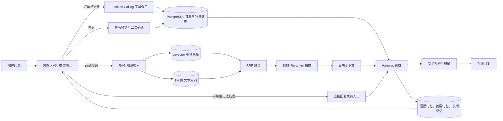

# 知微 Agent 电商客服系统

面向电商客服高频咨询、订单物流和售后处理场景，搭建 Agent 智能客服系统。系统通过意图分流、受控 ReAct、Function Calling 和 RAG 知识库检索，完成订单物流查询、售后信息收集、商品手册问答和自动化评测，解决人工重复查询、知识检索慢、上下文易丢失等问题，提升客服响应效率与回答准确性。

<p>
  
  
  
  
  
  
  
</p>

## 技术栈

Python / FastAPI / React / TypeScript / DeepSeek-V4-Flash / ReAct / Function Calling / PostgreSQL / pgvector / MinerU / BGE-small-zh / BGE-Reranker-Base / Docker Compose

## 核心指标

| 指标 | 当前结果 | 说明 |
|------|---------:|------|
| 样本规模 | 100 条 | 覆盖订单、物流、售后、闲聊和手册知识问答 |
| 意图路由准确率 | 99% | 99/100 通过 |
| 工具调用成功率 | 100% | 20/20 通过 |
| 检索召回率 Recall@2 | 95% | 57/60 通过 |
| RAG 回答准确率 | 93% | 56/60 通过 |
| 任务完成率 | 95% | 95/100 通过 |
| 平均每题耗时 | 3612.81 ms | 仅统计客服生成回答耗时 |
| 总耗时 | 655.03 秒 | 100 条评测总耗时 |
| 总成本 | 0.132998 CNY | 按 DeepSeek-V4-Flash 输入输出 token 价格折算 |

## 系统流程



## 系统能力

### 1. 文档解析入库

系统支持在前端批量上传 Osmo Pocket 系列 PDF 手册。后端为每份文件创建异步入库任务，避免上传请求被长时间阻塞，并在前端实时展示解析状态、页数、父块数、子块数、更新时间和错误信息。

入库流程如下：

1. 使用 MinerU 将 PDF 解析为 Markdown，保留页码、章节、表格和图片说明等结构信息。
2. 根据文件名和内容识别产品型号，包括 Pocket、Pocket 2、Pocket 3、Pocket 4 和 Pocket 4 Pro。
3. 按“型号、章节、小节、页码”构建文档层级。
4. 以完整小节作为父块存入 PostgreSQL，保留原文内容和章节路径。
5. 将正文按 500 字符、重叠 80 字符切分为子块，使用 BGE-small-zh 向量化后写入 pgvector。
6. 为每个子块写入父块 ID、型号、章节路径和页码范围，便于检索后补充上下文。

父子块设计让检索阶段使用更细粒度的子块，提高命中率；回答阶段再补充父块上下文，减少片段化回答。

### 2. 意图识别与工具调用

系统采用规则优先、LLM 兜底的方式识别用户意图和槽位。规则层优先处理明显的订单、物流、售后和知识问答请求；规则无法稳定判断时，再由 DeepSeek-V4-Flash 输出结构化路由结果。

当前接入 3 类业务工具：

- 订单查询：查询订单状态、商品信息和金额。
- 物流查询：查询物流公司、运单号和最新轨迹。
- 售后处理：生成售后预览，用户确认后再提交。

工具调用通过 Function Calling 进入受控执行层。执行前会校验必要参数，例如订单号、用户 ID 和售后原因；参数不足时先追问，不直接调用工具。读取类工具支持超时重试，异常结果会写入审计记录，并返回可控的失败提示。

### 3. RAG 知识问答

知识类问题会进入 RAG 检索链路。系统先根据用户问题识别可能涉及的型号，再对对应手册进行过滤检索，避免不同 Pocket 型号之间互相干扰。

检索流程如下：

1. 向量检索从 pgvector 召回 Top30 子块。
2. BM25 关键词检索从 PostgreSQL 文本索引召回 Top30 候选。
3. 使用 RRF 对两路候选进行融合排序，取 Top15。
4. 使用 BGE-Reranker-Base 对 Top15 精排，选取 Top3。
5. 将高相关上下文交给 LLM，生成自然语言回答。

当检索不到可靠依据时，系统不会编造答案，而是返回“暂时没有相关内容”。客服界面默认隐藏调试路由和引用编号，只保留面向用户的自然回复。

### 4. 会话记忆与流程恢复

系统维护三层会话记忆：

- 短期记忆：保留最近 12 轮对话，用于理解当前上下文和用户追问。
- 摘要记忆：当历史对话变长时，将早期内容压缩为摘要，降低上下文长度。
- 长期记忆：保存可复用的用户偏好和业务信息，并避免保存敏感内容。

同时，系统会持久化业务槽位和流程状态，例如等待订单号、等待售后确认、转人工中等状态。服务重启后，多轮任务仍可根据会话状态继续处理。

### 5. Harness 编排与安全控制

Harness 负责统一编排客服 Agent 的处理链路，包括路由、ReAct 调度、工具执行、RAG 检索、回复生成和异常兜底。它会记录每轮工具 Observation、重试次数、耗时、终止状态和失败原因，便于定位问题。

安全控制包括：

- 发送给模型前对订单号、手机号、地址、物流单号等敏感字段进行脱敏。
- 工具执行前做参数校验和权限边界检查。
- 售后写操作需要二次确认，避免误提交。
- 最终回复前检查是否泄露其他用户订单、是否编造物流或退款结果、是否混淆产品型号。
- 转人工时生成交接信息，包含用户问题、已收集字段、工具观察结果和失败原因。

### 6. 自动化评测

系统内置 100 条业务评测数据，覆盖意图识别、工具调用、知识召回、RAG 回答、任务完成率和平均耗时。评测结果在前端看板展示，可点击指标查看每条记录的输入、路由、回答、引用、耗时和失败原因。

评测数据不使用固定假结果，工具类用例会走实际工具执行链路，知识类用例会进入真实 RAG 检索链路。

## 页面展示

### 电商客服


### 手册入库


### 自动评测


## 项目结构

```text
zhiwei-ecommerce-cs-agent/
├── apps/
│   ├── api/
│   │   ├── app/
│   │   │   ├── main.py                 # FastAPI 入口
│   │   │   ├── harness.py              # Agent 流程编排
│   │   │   ├── controlled_react.py     # 受控 ReAct 调度
│   │   │   ├── intent_router.py        # 意图识别与槽位抽取
│   │   │   ├── rag.py                  # RAG 检索与回答生成
│   │   │   ├── pgvector_store.py       # PostgreSQL + pgvector 存储
│   │   │   ├── knowledge_ingestion.py  # MinerU 文档解析入库
│   │   │   ├── pdd_adapter.py          # 订单、物流、售后数据适配
│   │   │   ├── tools/                  # Function Calling 工具注册与执行
│   │   │   ├── memory/                 # 会话记忆与流程状态
│   │   │   └── evaluation/             # 自动化评测
│   │   ├── evals/                      # 100 条评测数据
│   │   ├── infra/postgres/             # PostgreSQL 初始化脚本
│   │   └── tests/                      # 后端测试
│   └── web/
│       ├── src/main.tsx                # React 前端入口
│       └── src/styles.css              # 页面样式
├── docs/images/                        # README 展示截图
├── docker-compose.mvp.yml              # PostgreSQL 服务编排
├── PROJECT_RESPONSE.md                 # 交付说明
└── README.MVP.md                       # MVP 快速说明
```

## 启动方式

### 1. 启动 PostgreSQL

```powershell
docker compose -f docker-compose.mvp.yml up -d postgres
```

如果提示无法连接 Docker API，需要先启动 Docker Desktop。

### 2. 启动后端

```powershell
cd "D:\客服 agent\apps\api"
python -m uvicorn app.main:app --reload --host 0.0.0.0 --port 8000
```

### 3. 启动前端

```powershell
cd "D:\客服 agent\apps\web"
npm run dev
```

前端访问地址：`http://localhost:5173`

## 常用接口

| 方法 | 接口 | 说明 |
|------|------|------|
| POST | `/api/v1/sessions` | 创建会话 |
| POST | `/api/v1/sessions/{session_id}/messages` | 发送客服消息 |
| POST | `/api/v1/knowledge/ingestion-jobs` | 创建手册入库任务 |
| GET | `/api/v1/knowledge/ingestion-jobs/{job_id}` | 查询入库任务状态 |
| GET | `/api/v1/knowledge/documents` | 查看已入库文档 |
| POST | `/api/v1/knowledge/documents/{document_id}/reindex` | 重新索引文档 |
| DELETE | `/api/v1/knowledge/documents/{document_id}` | 删除文档 |
| POST | `/api/v1/evaluation/run` | 执行自动评测 |
| GET | `/api/v1/evaluation/latest` | 查看最新评测结果 |

## 验证结果

本地已完成以下验证：

```powershell
npm run build
python -m py_compile apps\api\app\main.py apps\api\app\harness.py apps\api\app\rag.py apps\api\app\knowledge_ingestion.py apps\api\app\controlled_react.py
python -m pytest apps\api\tests
```

后端测试结果：`13 passed`。

## 说明

- PDF 原文件和运行时上传缓存不提交到仓库。
- 前端构建产物 `apps/web/dist` 不提交到仓库。
- 手册入库需要后端 Python 环境可以访问 `mineru` 命令。
- 本地未配置 DeepSeek Key 时，部分 LLM 生成与评测能力会走降级逻辑。